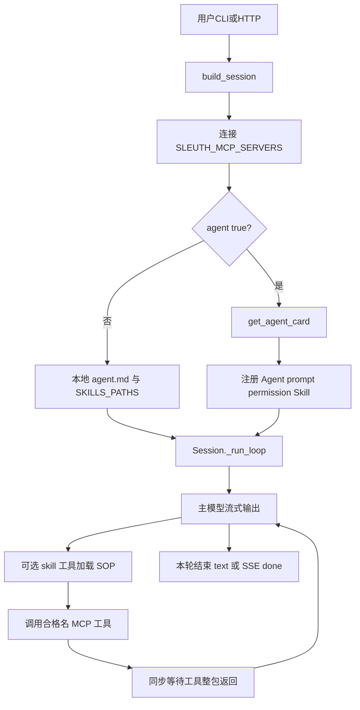
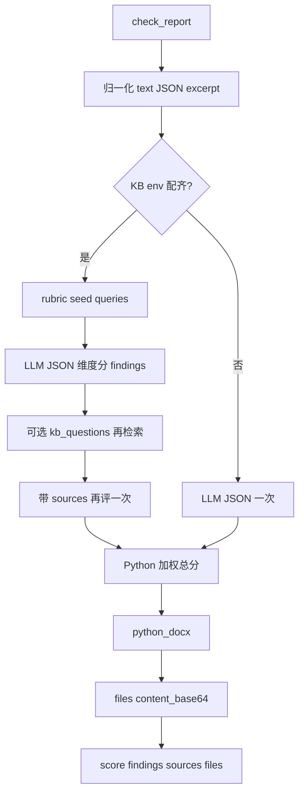
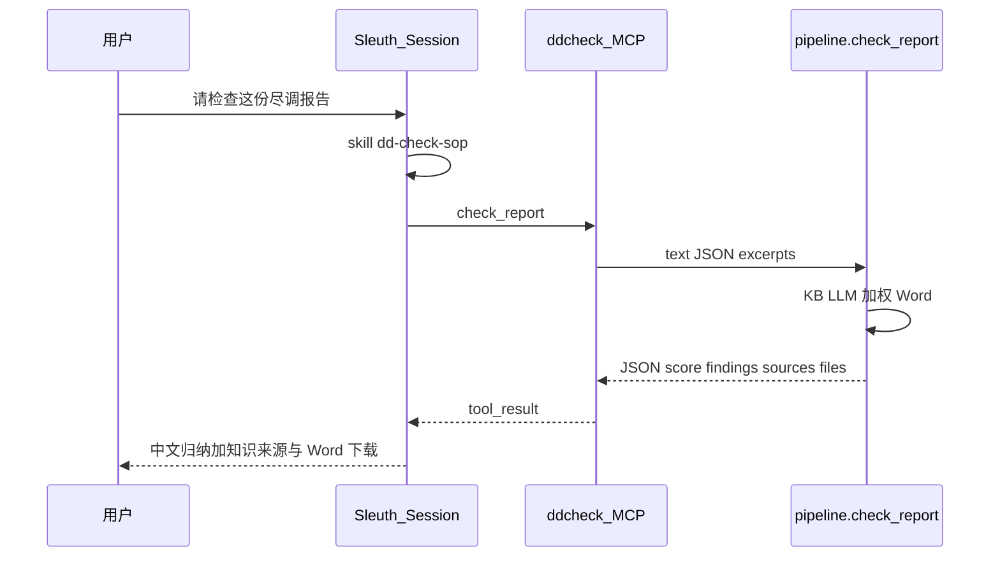
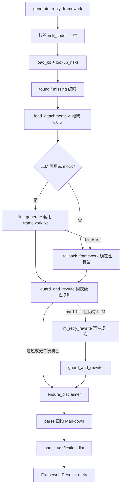
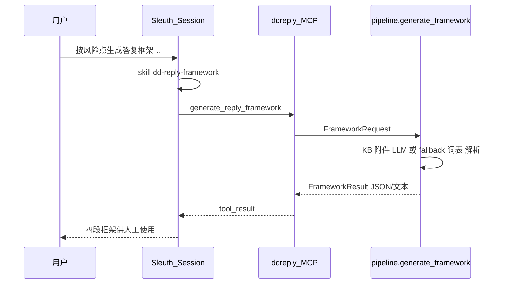

# Agent 场景内部流程图

> 当前仓库两个独立 Agent 包：`dd_check`（尽调报告检查）、`dd_reply`（尽调答复框架）。  
> 二者均通过 **MCP + 可选 Agent Card** 挂到 Sleuth，不修改 Sleuth 内核。  
> MCP / Skill 规范见 [`MCP_INTEGRATION.md`](MCP_INTEGRATION.md)、[`SKILL_INTEGRATION.md`](SKILL_INTEGRATION.md)。

---

## 0. 共性：Sleuth 外层会话如何进到 Agent



说明：

- HTTP SSE 可见：`text` → `tool_start` →（长时间可能无 text）→ `tool_result` → 更多 `text` → `done`。
- **不会**把下方 LangGraph / pipeline 的中间节点名推给前端；进度靠 `tool_start` 展示「执行中」。

默认端口与配置键：

| 场景 | 包 | MCP 键示例 | 默认 URL | Agent 名 | Skill |
|------|-----|------------|----------|----------|-------|
| 尽调检查 | `agents/dd_check` | `ddcheck` | `http://127.0.0.1:8791/mcp` | `dd_check` | `dd-check-sop` |
| 答复框架 | `agents/dd_reply` | `ddreply` | `http://127.0.0.1:8792/mcp` | `dd_reply` | `dd-reply-framework` |

```env
SLEUTH_MCP_SERVERS={"ddcheck":{"type":"remote","url":"http://127.0.0.1:8791/mcp","agent":true},"ddreply":{"type":"remote","url":"http://127.0.0.1:8792/mcp","agent":true}}
```

---

## 1. `dd_check` — 尽调报告检查

### 1.1 职责

对用户提交的已填写尽调报告（正文、结构化 JSON、纯文本、会话附件摘录）做填写检查：逻辑一致性、充分性、附件有效性等（口径在 `config/rubric.json`）。过程中可检索本包知识库；输出 findings（含 location）、加权总分、Word 回传。引擎为 **线性 pipeline**（脚手架生成后实现，不是 LangGraph）。

### 1.2 MCP 工具面（服务端原名 → Sleuth 合格名）

| MCP 工具 | 合格名（server=`ddcheck`） | 作用 |
|----------|---------------------------|------|
| `get_agent_card` | `ddcheck_get_agent_card` | 注册 Agent/Skill |
| `check_report` | `ddcheck_check_report` | 主检查（内部 LLM + 可选 KB + Word） |
| `kb_search` | `ddcheck_kb_search` | 仅 KB env 配齐时注册；排障用 |
| `emit_file` | `ddcheck_emit_file` | 仅 COS env 配齐时注册；排障用（会话 Word 走 `files[].content_base64`，不必开 COS） |
| `health` | `ddcheck_health` | 探活 |

入口：[`dd_check/mcp_server.py`](../agents/dd_check/dd_check/mcp_server.py) → [`pipeline.py`](../agents/dd_check/dd_check/pipeline.py) 的 `check_report`。

### 1.3 Pipeline 内部流转



会话附件由 Sleuth 解密并注入 `attachment_refs_json`；本进程不解 SM4。`DD_CHECK_HITL=1`（默认打开）且无正文、无 JSON、无附件 excerpt 时，`check_report` 返回 `status=need_input`，不进 LLM；Sleuth 用内置 `question` 暂停本轮。用户补料或明确继续（`proceed_with_gaps=true`）后再检查。

### 1.4 Sleuth 端到端



环境要点：本包 `DD_CHECK_LLM_*` 三项配齐则检查用自己的模型，未配齐则用 Sleuth 注入的会话模型；两头都没有则 `ok: false`。`DD_CHECK_ATTACHMENTS=1` 才注入附件；KB 按本包 `.env` 配齐后重启 MCP。Word 经 `files[].content_base64` 由 Sleuth 加密进会话邮箱，不必配本包 COS。关 `DD_CHECK_HITL` 后空材料会直接进检查。

---

## 2. `dd_reply` — 尽调答复框架

### 2.1 职责

给定风险点编码 + KYC 字段（+ 可选附件），生成四段式**人工参考**答复框架：预分析 / 答复正文 / 待核实清单 / 结论判定指引。引擎为 **线性 pipeline**（**不是** LangGraph）。字段不齐时工具返回 `need_input`，Sleuth 用内置 `question` 暂停本轮：列出缺项并询问用户是否还有补充；用户提供或明确说继续后再生成。

### 2.2 MCP 工具面

| MCP 工具 | 合格名（server=`ddreply`） | 作用 |
|----------|---------------------------|------|
| `get_agent_card` | `ddreply_get_agent_card` | 注册 Agent/Skill |
| `generate_reply_framework` | `ddreply_generate_reply_framework` | 主流程 |
| `lookup_risk_kb` | `ddreply_lookup_risk_kb` | 按编码查 KB |
| `list_risk_codes` | `ddreply_list_risk_codes` | 列出支持编码 |
| `list_lexicon` | `ddreply_list_lexicon` | 用语规范 |
| `health` | `ddreply_health` | MCP 探活（与 `GET /health` 同 JSON） |

HTTP：`GET /health`（与 MCP 同端口，供 Docker/K8s 探活，不走 MCP 协议）。

入口：[`dd_reply/mcp_server.py`](../agents/dd_reply/dd_reply/mcp_server.py) → [`pipeline.py`](../agents/dd_reply/dd_reply/pipeline.py) 的 `generate_framework`。

### 2.3 Pipeline 内部流转（逻辑步骤 = 代码顺序）



#### 步骤说明

| 步骤 | 代码关注点 | 行为 |
|------|------------|------|
| 校验 | `generate_framework` 入口 | 无 `risk_codes` 直接失败 |
| KB | `kb.load_kb` / `lookup_risks` | 精确匹配编码；未命中进 `missing` |
| 附件 | `attachments.load_attachments` | 路径和/或 `invest_id` 拉 COS 摘录 |
| LLM | `mockable_generate` + `prompts/framework.txt` | 注入风险上下文、字段、硬词表块 |
| Fallback | `_fallback_framework` | 无 LLM 时仍给出结构化骨架 |
| 词表守卫 | `lexicon_guard.guard_and_rewrite` | 硬规则命中可触发一次改写重试 |
| 免责声明 | `DISCLAIMER` | 缺失则追加 |
| 解析 | section / verification 解析 | 产出结构化 `FrameworkResult` |

### 2.4 Sleuth 端到端



风险点知识只走远程检索 API：先 `DD_REPLY_KB_LOGIN_URL` 取 `ragToken`，再 `DD_REPLY_KB_API_URL` 检索。`DD_REPLY_KB_PATH` 仅用于本地 `lexicon.json`（禁用词）。可选 `DD_REPLY_KB_SORT_COUNT`（默认 10）限制每个编码保留的命中条数。

---

## 3. 两场景对比

| | `dd_check` | `dd_reply` |
|--|--------------|------------|
| 业务 | 报告填写检查 / 加权评分 / Word | 答复框架生成 |
| 引擎 | 线性 pipeline + 本包 LLM | 线性 pipeline |
| HITL / Checkpoint | 空材料 `need_input` + 基座 `question` | 缺字段 `need_input` + 基座 `question` 暂停；用户选择补充或继续 |
| 主工具 | `ddcheck_check_report` | `ddreply_generate_reply_framework` |
| Skill | `dd-check-sop` | `dd-reply-framework` |
| 默认端口 | 8791 | 8792 |
| 挂载方式 | MCP `agent:true` 或本地 agent.md | 同左 |

---

## 4. 相关文档与代码

| 文档 / 代码 | 说明 |
|-------------|------|
| [`agents/dd_check/HOWTO_SLEUTH.md`](../agents/dd_check/HOWTO_SLEUTH.md) | 检查包接入 Sleuth |
| [`agents/dd_reply/HOWTO_SLEUTH.md`](../agents/dd_reply/HOWTO_SLEUTH.md) | 答复包接入 Sleuth |
| [`agents/dd_check/dd_check/pipeline.py`](../agents/dd_check/dd_check/pipeline.py) | 检查流水线真源 |
| [`agents/dd_reply/dd_reply/pipeline.py`](../agents/dd_reply/dd_reply/pipeline.py) | 流水线真源 |
| [`MCP_INTEGRATION.md`](MCP_INTEGRATION.md) | MCP Tool / Agent Card 规范 |
| [`ORCHESTRATION.md`](ORCHESTRATION.md) | 编排模式 A–G、配置、HTTP/CLI、装配层检查清单 |
| [`SKILL_INTEGRATION.md`](SKILL_INTEGRATION.md) | Skill 规范 |
| [`API.md`](API.md) | HTTP / SSE 前端对接 |

---

## 5. 编排模式（可选，默认 Mode A）

Sleuth 默认仍是 **Mode A：基座编排**（§0 流程图）。专岗 MCP 内部已是线性 pipeline（接近 **Mode C**）。可通过 Agent Card + HTTP 显式启用其它模式；**横切能力不变**（ACL、记忆、HITL、KB、文件邮箱均走 Session + bridge）。

| 模式 | 基座 LLM | 典型触发 | `dd_check` |
|------|----------|----------|------------|
| A host | 高 | 默认 | 中 |
| C pipeline | 低（SOP 约束一次主工具） | Card `orchestration: pipeline` | **最高** |
| F auto_invoke | 极低 | `auto_run: true` / `--auto-run` | 高 |
| B delegate | 低 | `task` + `delegatable: true` | 高 |
| D async | 可选 | `execution: async` | 高 |
| E parallel | 中 | `parallel: [...]` | 中 |

配置与请求字段详见 [`ORCHESTRATION.md`](ORCHESTRATION.md)。`dd_check` 出厂 Card：`orchestration: pipeline`、`primary_tool: ddcheck_check_report`。
