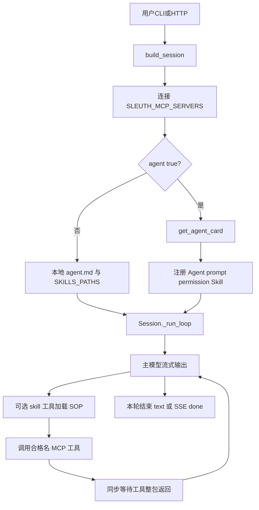
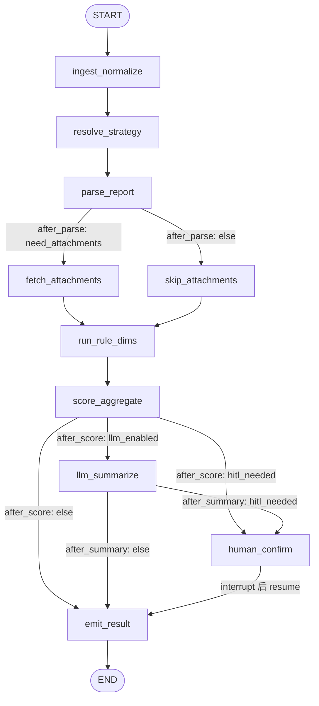
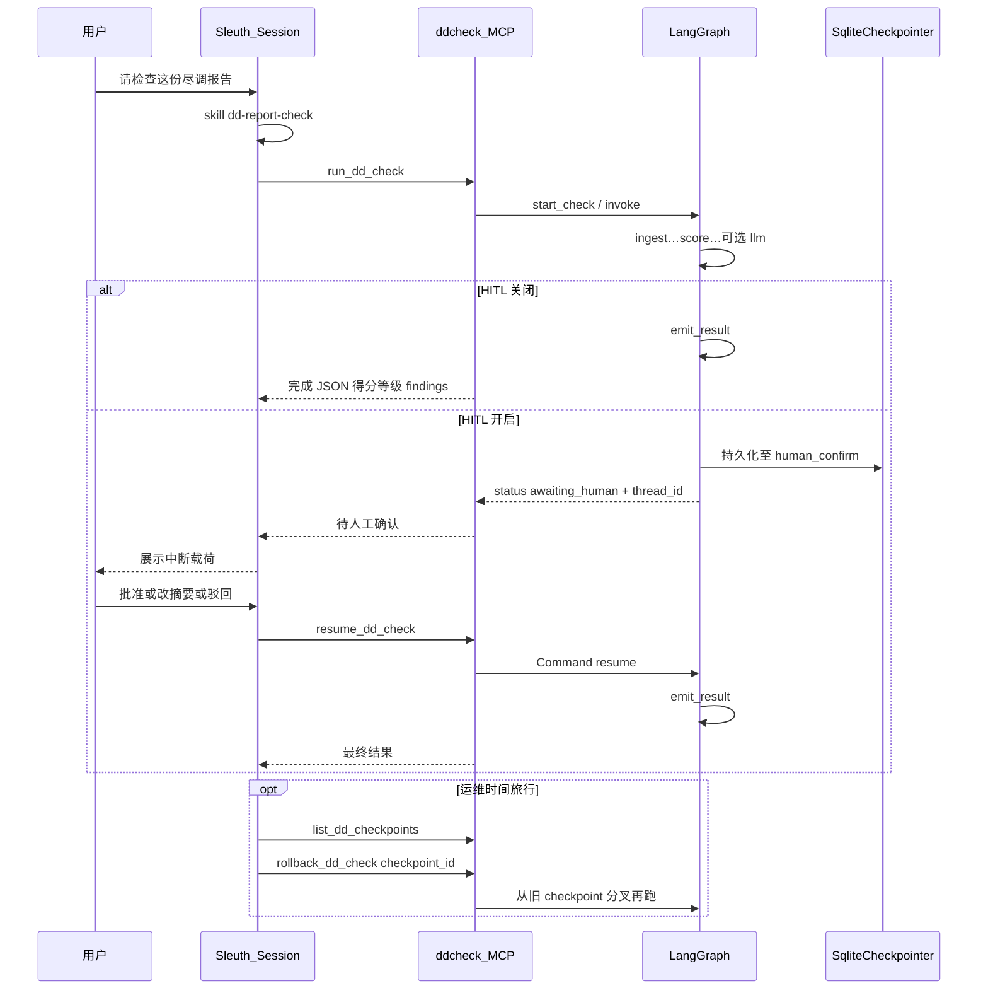
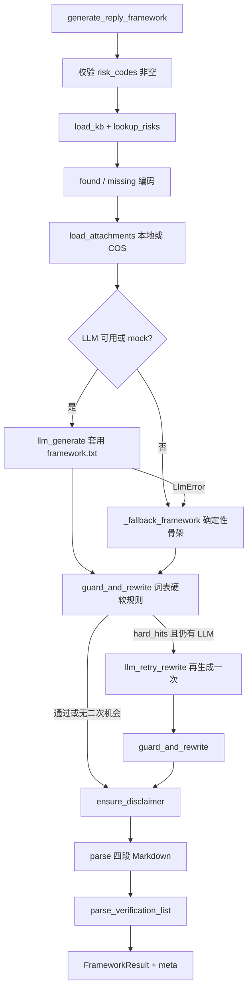
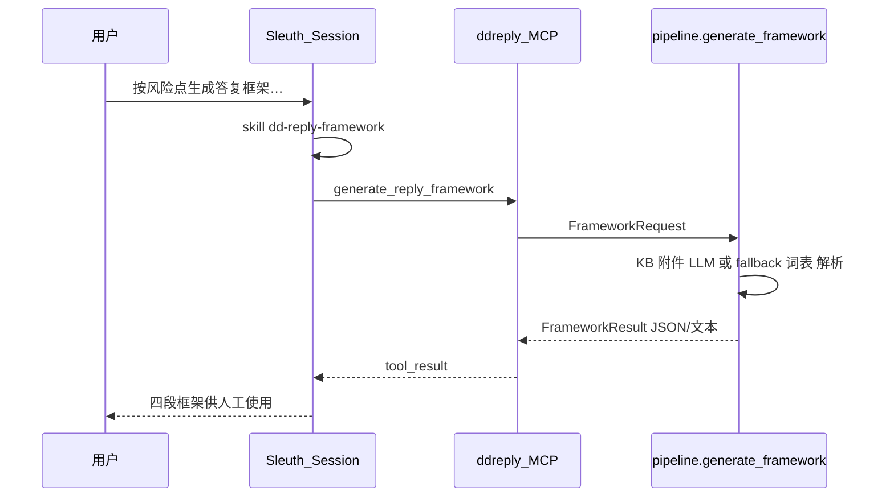

# Agent 场景内部流程图

> 当前仓库两个独立 Agent 包：`dd_analyst`（尽调报告检查）、`dd_reply`（尽调答复框架）。  
> 二者均通过 **MCP + 可选 Agent Card** 挂到 Sleuth，不修改 Sleuth 内核。  
> MCP / Skill 规范见 [`MCP_INTEGRATION.md`](MCP_INTEGRATION.md)、[`SKILL_INTEGRATION.md`](SKILL_INTEGRATION.md)。

---

## 0. 共性：Sleuth 外层会话如何进到 Agent



说明：

- HTTP SSE 可见：`text` → `tool_start` →（长时间可能无 text）→ `tool_result` → 更多 `text` → `done`。
- **不会**把下方 LangGraph / pipeline 的中间节点名推给前端；进度靠 `tool_start` 展示「执行中」。

默认端口与配置键：

| 场景 | 包 | MCP 键示例 | 默认 URL | Agent 名 | Skill |
|------|-----|------------|----------|----------|-------|
| 尽调检查 | `agents/dd_analyst` | `ddcheck` | `http://127.0.0.1:8791/mcp` | `dd_analyst` | `dd-report-check` |
| 答复框架 | `agents/dd_reply` | `ddreply` | `http://127.0.0.1:8792/mcp` | `dd_reply` | `dd-reply-framework` |

```env
SLEUTH_MCP_SERVERS={"ddcheck":{"type":"remote","url":"http://127.0.0.1:8791/mcp","agent":true},"ddreply":{"type":"remote","url":"http://127.0.0.1:8792/mcp","agent":true}}
```

---

## 1. `dd_analyst` — 尽调报告检查

### 1.1 职责

对尽调报告做策略解析 → 规则维度检查 → 评分定级 → 可选 LLM 摘要 → 可选人工确认（HITL）→ 落结果。引擎为 **LangGraph**。

### 1.2 MCP 工具面（服务端原名 → Sleuth 合格名）

| MCP 工具 | 合格名（server=`ddcheck`） | 作用 |
|----------|---------------------------|------|
| `get_agent_card` | `ddcheck_get_agent_card` | 注册 Agent/Skill |
| `run_dd_check` | `ddcheck_run_dd_check` | 启动检查图 |
| `resume_dd_check` | `ddcheck_resume_dd_check` | HITL 继续（非 rollback） |
| `list_dd_checkpoints` | `ddcheck_list_dd_checkpoints` | 检查点列表 |
| `rollback_dd_check` | `ddcheck_rollback_dd_check` | 从 checkpoint 时间旅行分叉 |
| `run_dd_batch` | `ddcheck_run_dd_batch` | 批量（强制关 HITL） |
| `describe_graph` | `ddcheck_describe_graph` | 静态图说明 |
| `health` | `ddcheck_health` | 探活 |

入口实现：[`dd_check/mcp_server.py`](../agents/dd_analyst/dd_check/mcp_server.py) → [`graph/runner.py`](../agents/dd_analyst/dd_check/graph/runner.py)。

### 1.3 LangGraph 节点与条件边（代码节点名）

图编译：[`graph/build.py`](../agents/dd_analyst/dd_check/graph/build.py)；路由：[`graph/routing.py`](../agents/dd_analyst/dd_check/graph/routing.py)；节点：[`graph/nodes.py`](../agents/dd_analyst/dd_check/graph/nodes.py)。



#### 节点做什么

| 节点 | 内部行为（摘要） |
|------|------------------|
| `ingest_normalize` | 规范化入参（报告文本、invest_id、选项等）写入 `CheckState` |
| `resolve_strategy` | 按策略模板解析检查维度 / 规则集 |
| `parse_report` | 解析报告结构；决定是否需要拉附件 |
| `fetch_attachments` | MySQL 元数据 + COS + 可选 SM4 解密，取附件文本 |
| `skip_attachments` | 无附件路径的空操作汇合点 |
| `run_rule_dims` | 按维度跑规则，产出 findings |
| `score_aggregate` | 汇总得分、等级、风险结论 |
| `llm_summarize` | 可选：调用 LLM 生成自然语言摘要 |
| `human_confirm` | `interrupt(payload)` 暂停；等待 `resume` 决策（approve / edit_summary / reject） |
| `emit_result` | 组装最终结果（可写结果库） |

#### 路由条件

| 函数 | 出口 | 条件 |
|------|------|------|
| `after_parse` | `fetch_attachments` / `skip_attachments` | `need_attachments` |
| `after_score` | `llm_summarize` / `human_confirm` / `emit_result` | `llm_enabled`；否则看 `hitl_needed` |
| `after_summary` | `human_confirm` / `emit_result` | `hitl_needed` |
| `hitl_needed`（语义） | — | `hitl_enabled` 且（非仅失败才打断 **或** 存在 FAIL finding） |

### 1.4 含 HITL / Checkpoint 的端到端流转



环境要点：

- `DD_CHECK_HITL=1` 时必须配置 `DD_CHECK_CHECKPOINT_SQLITE_PATH`，并先执行 DDL（`deploy/ddl_langgraph_checkpoint.sql`）。
- 批量 `run_dd_batch` **强制关闭 HITL**。
- `resume_dd_check` ≠ `rollback_dd_check`：前者继续中断点，后者从历史 checkpoint 分叉。

### 1.5 同步无 HITL 的最短路径

```text
START
 → ingest_normalize → resolve_strategy → parse_report
 → skip_attachments（或 fetch_attachments）
 → run_rule_dims → score_aggregate
 → [llm_summarize?]
 → emit_result → END
```

---

## 2. `dd_reply` — 尽调答复框架

### 2.1 职责

给定风险点编码 + KYC 字段（+ 可选附件），生成四段式**人工参考**答复框架：预分析 / 答复正文 / 待核实清单 / 结论判定指引。引擎为 **线性 pipeline**（**不是** LangGraph），无 HITL。

### 2.2 MCP 工具面

| MCP 工具 | 合格名（server=`ddreply`） | 作用 |
|----------|---------------------------|------|
| `get_agent_card` | `ddreply_get_agent_card` | 注册 Agent/Skill |
| `generate_reply_framework` | `ddreply_generate_reply_framework` | 主流程 |
| `lookup_risk_kb` | `ddreply_lookup_risk_kb` | 按编码查 KB |
| `list_risk_codes` | `ddreply_list_risk_codes` | 列出支持编码 |
| `list_lexicon` | `ddreply_list_lexicon` | 用语规范 |
| `health` | `ddreply_health` | 探活 |

入口：[`dd_reply/mcp_server.py`](../agents/dd_reply/dd_reply/mcp_server.py) → [`pipeline.py`](../agents/dd_reply/dd_reply/pipeline.py) 的 `generate_framework`。

### 2.3 Pipeline 内部流转（逻辑步骤 = 代码顺序）



#### 步骤说明

| 步骤 | 代码关注点 | 行为 |
|------|------------|------|
| 校验 | `generate_framework` 入口 | 无 `risk_codes` 直接失败 |
| KB | `kb.load_kb` / `lookup_risks` | 精确匹配编码；未命中进 `missing` |
| 附件 | `attachments.load_attachments` | 路径和/或 `invest_id` 拉 COS 摘录 |
| LLM | `mockable_generate` + `prompts/framework.txt` | 注入风险上下文、字段、硬词表块 |
| Fallback | `_fallback_framework` | 无 LLM 时仍给出结构化骨架 |
| 词表守卫 | `lexicon_guard.guard_and_rewrite` | 硬规则命中可触发一次改写重试 |
| 免责声明 | `DISCLAIMER` | 缺失则追加 |
| 解析 | section / verification 解析 | 产出结构化 `FrameworkResult` |

### 2.4 Sleuth 端到端



可选：`DD_REPLY_KB_PATH` 指向外部知识库目录（`risk_points.json`、`lexicon.json`）。

---

## 3. 两场景对比

| | `dd_analyst` | `dd_reply` |
|--|--------------|------------|
| 业务 | 报告检查 / 评分 | 答复框架生成 |
| 引擎 | LangGraph | 线性 pipeline |
| HITL / Checkpoint | 可选 | 无 |
| 主工具 | `ddcheck_run_dd_check` | `ddreply_generate_reply_framework` |
| Skill | `dd-report-check` | `dd-reply-framework` |
| 默认端口 | 8791 | 8792 |
| 挂载方式 | MCP `agent:true` 或本地 agent.md | 同左 |

---

## 4. 相关文档与代码

| 文档 / 代码 | 说明 |
|-------------|------|
| [`agents/dd_analyst/HOWTO_SLEUTH.md`](../agents/dd_analyst/HOWTO_SLEUTH.md) | 检查包接入 Sleuth |
| [`agents/dd_reply/HOWTO_SLEUTH.md`](../agents/dd_reply/HOWTO_SLEUTH.md) | 答复包接入 Sleuth |
| [`agents/dd_analyst/dd_check/graph/build.py`](../agents/dd_analyst/dd_check/graph/build.py) | 图结构真源 |
| [`agents/dd_reply/dd_reply/pipeline.py`](../agents/dd_reply/dd_reply/pipeline.py) | 流水线真源 |
| [`MCP_INTEGRATION.md`](MCP_INTEGRATION.md) | MCP Tool / Agent Card 规范 |
| [`SKILL_INTEGRATION.md`](SKILL_INTEGRATION.md) | Skill 规范 |
| [`API.md`](API.md) | HTTP / SSE 前端对接 |
