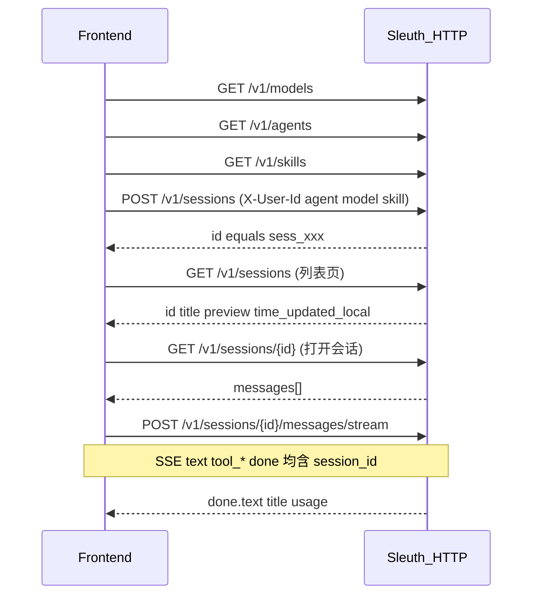

# Sleuth HTTP API 接口文档（前端对接）

> 基于当前实现：[`sleuth/server/app.py`](../sleuth/server/app.py)  
> 默认基址：`http://127.0.0.1:8787`（`SLEUTH_SERVER_HOST` / `SLEUTH_SERVER_PORT`）  
> Content-Type：除非另有说明，请求/响应均为 `application/json; charset=utf-8`

CLI 交互与下列能力对齐（斜杠命令）：`/sessions` `/session` `/model` `/agent` `/mcp` `/skill` `/skills` `/usage` `/yolo` — 目录字段与 `GET /v1/models|agents|mcp|skills` 同源（[`sleuth/catalog.py`](../sleuth/catalog.py)）。

---

## 1. 启动服务

```powershell
cd <sleuth 仓库根目录>
py -3.12 -m pip install -e ".[server]"   # 或 .[all]
py -3.12 -m sleuth.server
```

| 环境变量 | 默认 | 说明 |
|----------|------|------|
| `SLEUTH_SERVER_HOST` | `127.0.0.1` | 监听地址 |
| `SLEUTH_SERVER_PORT` | `8787` | 端口 |
| `SLEUTH_SERVER_ADMIN_TOKEN` | 空 | 管理接口口令；**为空则不做 admin 校验** |
| `SLEUTH_SERVER_DEFAULT_BACKEND` | `sqlite` | 服务端默认存储 |
| `SLEUTH_TIMEZONE` | `Asia/Shanghai` | 列表里 `time_updated_local` 的时区 |

---

## 2. 通用约定

### 2.1 用户隔离

几乎所有会话接口按 **用户** 隔离。用户 ID 解析优先级：

1. 请求头 `X-User-Id`
2. Query：`?user_id=`
3. 默认：`anonymous`

创建会话时 body 里的 `user_id` 优先于上述 header/query。

前端建议：登录后固定把业务用户 id 放进 `X-User-Id`。

### 2.2 管理鉴权

部分接口需要请求头：

```http
X-Admin-Token: <与 SLEUTH_SERVER_ADMIN_TOKEN 相同>
```

若服务端 **未配置** `SLEUTH_SERVER_ADMIN_TOKEN`，则管理校验关闭（开发方便，生产务必配置）。

### 2.3 错误响应

统一为 JSON：

```json
{ "error": "说明文字" }
```

常见 HTTP 状态码：

| 状态码 | 含义 |
|--------|------|
| `200` | 成功 |
| `400` | 参数错误（如缺 prompt、非法 model） |
| `401` | Admin Token 不匹配 |
| `404` | 会话不存在，或不属于当前用户 |

### 2.4 重要限制（对接必读）

- **会话主键**：创建/列表/详情响应字段名为 **`id`**；发消息回包与 SSE 事件字段名为 **`session_id`**。二者是**同一值**（如 `sess_a1b2…`），前端统一存成 `sessionId` 即可。多会话时所有读写必须带该 id（URL 路径），并固定 `X-User-Id`。
- **同步发消息**：`POST .../messages` 会阻塞到整轮 Agent（含工具调用）跑完再返回整包 JSON。前端需设足够长的超时（建议 ≥ 5–15 分钟），并做好 loading。
- **流式发消息**：`POST .../messages/stream` 使用 **SSE**（`text/event-stream`），边跑边推 `text` / 工具事件，最后以 `done` 收尾。**每条 `data` 事件均含 `session_id`**。原生 `EventSource` 只支持 GET，请用 `fetch` + `ReadableStream`。
- **模型 / Agent / Skill 选择**：每次创建会话和发消息都应带 `agent`、`model`、`skill`。未选 agent / model 时传 `GET /v1/agents`、`GET /v1/models` 的 `default`；未选 skill、或当前不是默认 agent 时传 `skill: ""`。Skill **仅当 `agent` 等于默认 agent** 时可选并注入 SKILL.md；专用 agent 带非空 `skill` 返回 `400`。字段省略时兼容旧客户端（沿用会话已存值），前端主路径不要依赖省略。MCP 可晚于 Sleuth 启动，后台会重试；也可 `POST /v1/mcp/reload` 立即重连后再拉 agents。
- **无 CORS 中间件**：浏览器跨域需自行在网关加 CORS，或同域反代。
- **会话 id** 形如：`sess_` + 24 位 hex（例：`sess_a1b2c3d4e5f678901234abcd`）。
- 时间字段：
  - `time_updated`：Unix **毫秒**
  - `time_updated_local`：按 `SLEUTH_TIMEZONE` 格式化的字符串，如 `2026-08-08 18:09:12`

### 2.5 `model` 对象形态（注意两处略有不同）

**创建会话 / 发消息** 成功响应里的 `model`：

```json
{
  "ref": "deepseek-chat/deepseek-chat",
  "id": "deepseek-chat",
  "providerID": "deepseek-chat"
}
```

**列表 / 详情** 里落库的 `model` 多为：

```json
{
  "id": "deepseek-chat",
  "providerID": "deepseek-chat"
}
```

`model` 请求参数可为：

- `SLEUTH_MODELS` 里的 alias（如 `qwen-max`）
- 或 `provider/model`（如 `openai/gpt-4o-mini`）

---

## 3. 接口一览

| 方法 | 路径 | 鉴权 | 说明 |
|------|------|------|------|
| `GET` | `/health` | 无 | 探活 |
| `POST` | `/v1/sessions` | 用户头 | 创建会话 |
| `GET` | `/v1/sessions` | 用户头 | 会话列表（含预览） |
| `GET` | `/v1/sessions/{session_id}` | 用户头 | 会话详情 + 消息 |
| `POST` | `/v1/sessions/{session_id}/messages` | 用户头 | 发送一轮对话（**同步 JSON**） |
| `POST` | `/v1/sessions/{session_id}/messages/stream` | 用户头 | 发送一轮对话（**SSE 流式**） |
| `GET` | `/v1/models` | 无 | 模型目录（选择器用；不含密钥） |
| `GET` | `/v1/agents` | 无 | Agent 目录（含 `available` / MCP 状态） |
| `GET` | `/v1/mcp` | 无 | MCP 服务连接状态 |
| `POST` | `/v1/mcp/reload` | Admin | 热重载 MCP（重连 + 刷新 Agent Card） |
| `GET` | `/v1/users/{user_id}/usage` | 本人或 Admin | 用量汇总 |
| `GET` | `/v1/skills` | 无 | Skill 目录（默认 agent 下发消息 body 的 `skill` 用此 `name`） |
| `POST` | `/v1/skills/reload` | Admin | 强制重载 Skill |

---

## 4. 接口详情

### 4.1 健康检查

`GET /health`

**请求**：无参数。

**响应 `200`**

```json
{ "ok": true }
```

---

### 4.2 创建会话

`POST /v1/sessions`

**Headers**

| Header | 必填 | 说明 |
|--------|------|------|
| `Content-Type` | 是 | `application/json` |
| `X-User-Id` | 建议 | 用户 id |

**Body**

| 字段 | 类型 | 必填 | 默认 | 说明 |
|------|------|------|------|------|
| `user_id` | string | 否 | 见 §2.1 | 覆盖 header 中的用户 |
| `agent` | string | 否 | 服务端 `default_agent`（常为 `build`） | Agent **id**（`GET /v1/agents` 的 `name`）。未选时传该接口的 `default` |
| `yolo` | boolean | 否 | `true` | `true` 时自动批准工具调用 |
| `model` | string | 否 | 配置默认模型 | 未选时传 `GET /v1/models` 的 `default` |
| `skill` | string | 否 | `""`（无绑定） | 仅默认 agent 可非空；未选或专用 agent 时传 `""` |

**请求示例**

```http
POST /v1/sessions HTTP/1.1
Host: 127.0.0.1:8787
Content-Type: application/json
X-User-Id: alice

{
  "agent": "build",
  "yolo": true,
  "model": "qwen-max",
  "skill": ""
}
```

**响应 `200`**

```json
{
  "id": "sess_a1b2c3d4e5f678901234abcd",
  "user_id": "alice",
  "title": "New session - 2026-08-08 18:09:12",
  "agent": "build",
  "model": {
    "ref": "qwen-max/qwen-max",
    "id": "qwen-max",
    "providerID": "qwen-max"
  },
  "skill": null
}
```

响应里的 **`id` 即会话主键**，与发消息/SSE 中的 `session_id` 相同。

**错误**

| 状态 | body |
|------|------|
| `400` | `{ "error": "invalid model: ..." }` |
| `400` | `{ "error": "invalid skill: ..." }` |
| `400` | `{ "error": "skill only allowed when agent is the default agent" }` |

---

### 4.3 会话列表

`GET /v1/sessions`

**Headers / Query**

| 参数 | 位置 | 必填 | 默认 | 说明 |
|------|------|------|------|------|
| `X-User-Id` / `user_id` | header / query | 建议 | `anonymous` | 只返回该用户会话 |
| `limit` | query | 否 | `50` | 条数，服务端会夹在 1–100 |

**请求示例**

```http
GET /v1/sessions?limit=20 HTTP/1.1
X-User-Id: alice
```

**响应 `200`**：JSON **数组**（按 `time_updated` 新→旧）

```json
[
  {
    "id": "sess_bbb222...",
    "user_id": "alice",
    "title": "尽调报告检查 - XX银行",
    "agent": "dd_analyst",
    "model": { "id": "qwen-max", "providerID": "qwen-max" },
    "skill": null,
    "tokens_input": 1200,
    "tokens_output": 340,
    "time_updated": 1723123456789,
    "time_updated_local": "2026-08-08 18:09:12",
    "preview": "请检查下面这份尽调报告…"
  }
]
```

| 字段 | 说明 |
|------|------|
| `preview` | 该会话**首条用户消息**截断预览（约 80 字）；尚无用户消息则为 `""` |
| `time_updated_local` | 本地时区可读时间，便于 UI 直接展示 |
| `title` | 默认带创建时间；首轮对话后可能被模型改写为语义标题 |

---

### 4.4 会话详情（含消息）

`GET /v1/sessions/{session_id}`

**路径参数**：`session_id` — 会话 id。

**Headers**：`X-User-Id`（必须能匹配该会话归属用户，否则 404）。

**响应 `200`**

```json
{
  "id": "sess_a1b2c3d4e5f678901234abcd",
  "user_id": "alice",
  "title": "尽调报告检查 - XX银行",
  "agent": "dd_analyst",
  "model": { "id": "qwen-max", "providerID": "qwen-max" },
  "skill": null,
  "cost": 0.045,
  "tokens": {
    "input": 5000,
    "output": 1200,
    "reasoning": 0,
    "cache_read": 0,
    "cache_write": 0
  },
  "messages": [
    {
      "id": "msg_...",
      "role": "user",
      "text": "请检查这份尽调报告…",
      "usage": null,
      "cost": null
    },
    {
      "id": "msg_...",
      "role": "assistant",
      "text": "检查结论：…",
      "usage": { "input": 100, "output": 50 },
      "cost": 0.001
    }
  ]
}
```

| `messages[].role` | 含义 |
|-------------------|------|
| `user` | 用户 |
| `assistant` | 助手（`text` 为拼接后的可见文本；含工具轮次时可能较碎，以落库为准） |
| `tool` | 工具结果消息（若存在；`text` 为工具输出摘要） |

**错误**

| 状态 | body |
|------|------|
| `404` | `{ "error": "not found" }` |

---

### 4.5 发送消息（一轮 Agent）

`POST /v1/sessions/{session_id}/messages`

**说明**：同步执行完整 agent 循环（可能多次工具调用），**耗时长**。成功后返回本轮助手最终文本。

**Headers**

| Header | 必填 |
|--------|------|
| `Content-Type: application/json` | 是 |
| `X-User-Id` | 是（须与会话用户一致） |

**Body**

| 字段 | 类型 | 必填 | 默认 | 说明 |
|------|------|------|------|------|
| `prompt` | string | 二选一 | — | 用户输入（推荐） |
| `text` | string | 二选一 | — | 与 `prompt` 等价，兼容字段 |
| `agent` | string | 否 | 未选时传默认 agent | 每轮带当前选择器值 |
| `yolo` | boolean | 否 | `true` | 是否自动批准工具 |
| `model` | string | 否 | 未选时传默认模型 | 每轮带当前选择器值 |
| `skill` | string | 否 | `""` | 仅默认 agent 可非空；否则传 `""` |

**请求示例**

```http
POST /v1/sessions/sess_a1b2c3d4e5f678901234abcd/messages HTTP/1.1
Content-Type: application/json
X-User-Id: alice

{
  "prompt": "请检查下面这份尽调报告：\n{...}",
  "agent": "build",
  "model": "qwen-max",
  "skill": "dd-report-check",
  "yolo": true
}
```

**响应 `200`**

```json
{
  "session_id": "sess_a1b2c3d4e5f678901234abcd",
  "text": "综合得分 72（等级 C）；主要问题：…",
  "title": "尽调报告检查 - XX银行",
  "agent": "build",
  "model": {
    "ref": "qwen-max/qwen-max",
    "id": "qwen-max",
    "providerID": "qwen-max"
  },
  "skill": "dd-report-check",
  "usage": {
    "input": 1200,
    "output": 400,
    "reasoning": 0,
    "cache_read": 0,
    "cache_write": 0
  },
  "cost": 0.0123
}
```

| 字段 | 说明 |
|------|------|
| `text` | 本轮助手对用户可见的最终文本 |
| `usage` | **本轮最后一次**模型调用用量（非整会话累加） |
| `cost` | 会话累计费用估算 |
| `title` | 可能在首轮后更新为语义标题 |
| `skill` | 当前绑定的 skill 名；未选为 `null` |

**错误**

| 状态 | body |
|------|------|
| `400` | `{ "error": "invalid json" }` |
| `400` | `{ "error": "prompt required" }` |
| `400` | `{ "error": "invalid model: ..." }` |
| `400` | `{ "error": "invalid skill: ..." }` |
| `400` | `{ "error": "skill only allowed when agent is the default agent" }` |
| `404` | `{ "error": "not found" }` |

---

### 4.5.1 发送消息（SSE 流式）

`POST /v1/sessions/{session_id}/messages/stream`

**说明**：与 §4.5 **同一套鉴权与 Body**，但响应为 **SSE**。模型侧 `text` 按增量推送；MCP/工具为同步等待，期间会先有 `tool_start`，结束后有 `tool_result`（中间可能长时间没有 `text`）。连接结束前必有一条 `type=done`（含完整 `text`，请以前端最终对齐为准）。

**Headers**

| Header | 必填 | 说明 |
|--------|------|------|
| `Content-Type: application/json` | 是 | 请求体仍是 JSON |
| `X-User-Id` | 是 | 须与会话用户一致 |
| `Accept: text/event-stream` | 建议 | |

**Body**：同 §4.5（每轮带 `prompt` / `agent` / `model` / `skill`）。

**成功时 HTTP `200`**，`Content-Type: text/event-stream`。

每帧格式（**每条 `data` 均含 `session_id`**）：

```text
data: {"type":"text","delta":"你好","session_id":"sess_a1b2c3d4e5f678901234abcd"}\n\n
```

心跳（可忽略，无 JSON）：

```text
: ping\n\n
```

#### 事件类型一览

所有下列事件（除心跳）都带 `session_id`。

| `type` | 字段 | 说明 |
|--------|------|------|
| `text` | `delta`, `session_id` | 助手可见文本增量（拼起来即正文） |
| `reasoning` | `delta`, `session_id` | 思考过程增量（可忽略） |
| `step` | `step`, `max_steps`, `session_id` | Agent 循环步数 |
| `tool_start` | `name`, `args_preview`, `session_id` | 开始调用工具（含 MCP）；`args_preview` 已截断 |
| `tool_result` | `name`, `is_error`, `output_preview`, `session_id` | 工具返回；`output_preview` 已截断 |
| `retry` | `attempt`, `message`, `wait`, `session_id` | 模型调用重试 |
| `stop` | `reason`, `usage`, `session_id` | 单次模型流结束（一轮里可能多次） |
| `error` | `message`, `session_id` | 错误信息（连接可能仍继续到 `done`） |
| `done` | 见下表 | **收尾**；对齐完整结果 |

#### `done` 载荷

```json
{
  "type": "done",
  "session_id": "sess_a1b2c3d4e5f678901234abcd",
  "text": "综合得分 72（等级 C）；主要问题：…",
  "title": "尽调报告检查 - XX银行",
  "agent": "build",
  "model": {
    "ref": "qwen-max/qwen-max",
    "id": "qwen-max",
    "providerID": "qwen-max"
  },
  "skill": "dd-report-check",
  "usage": {
    "input": 1200,
    "output": 400,
    "reasoning": 0,
    "cache_read": 0,
    "cache_write": 0
  },
  "cost": 0.0123
}
```

与同步接口字段对齐：`text` / `title` / `agent` / `model` / `skill` / `usage` / `cost`。

#### 示例事件流（示意）

```text
data: {"type":"step","step":1,"max_steps":30,"session_id":"sess_..."}

data: {"type":"text","delta":"正在","session_id":"sess_..."}

data: {"type":"text","delta":"检查…","session_id":"sess_..."}

data: {"type":"tool_start","name":"ddcheck_run_dd_check","args_preview":"{...}","session_id":"sess_..."}

data: {"type":"tool_result","name":"ddcheck_run_dd_check","is_error":false,"output_preview":"{...}","session_id":"sess_..."}

data: {"type":"text","delta":"\n结论：得分 72","session_id":"sess_..."}

data: {"type":"done","session_id":"sess_...","text":"正在检查…\n结论：得分 72","title":"...","model":{...},"usage":{...},"cost":0.01}
```

#### 与同步接口对比

| | `POST .../messages` | `POST .../messages/stream` |
|--|---------------------|----------------------------|
| 响应 | 一次 JSON（含 `session_id`） | SSE 多帧（每帧含 `session_id`）+ 最后 `done` |
| 打字机 | 否 | 是（拼 `text.delta`） |
| 工具进度 | 无 | `tool_start` / `tool_result` |
| 记忆 / 用户隔离 | 相同 | 相同 |

#### 前端示例（`fetch` + ReadableStream）

```javascript
async function streamMessage(base, sessionId, userId, prompt) {
  const res = await fetch(`${base}/v1/sessions/${sessionId}/messages/stream`, {
    method: "POST",
    headers: {
      "Content-Type": "application/json",
      "X-User-Id": userId,
      Accept: "text/event-stream",
    },
    body: JSON.stringify({ prompt, yolo: true }),
  });
  if (!res.ok) throw new Error(await res.text());
  const reader = res.body.getReader();
  const decoder = new TextDecoder();
  let buf = "";
  let full = "";
  while (true) {
    const { value, done } = await reader.read();
    if (done) break;
    buf += decoder.decode(value, { stream: true });
    const parts = buf.split("\n\n");
    buf = parts.pop() || "";
    for (const chunk of parts) {
      const line = chunk.split("\n").find((l) => l.startsWith("data: "));
      if (!line) continue;
      const ev = JSON.parse(line.slice(6));
      if (ev.type === "text") {
        full += ev.delta || "";
        // update UI with full or ev.delta
      } else if (ev.type === "tool_start") {
        // show “工具执行中: ” + ev.name
      } else if (ev.type === "done") {
        full = ev.text || full; // 以 done.text 为准
        return ev;
      }
    }
  }
}
```

**错误（在建立流之前）**：与 §4.5 相同，返回普通 JSON（`400` / `404`），不是 SSE。

**客户端断开**：服务端会 `cancel` 当前轮，尽量停止后续模型/工具调用。

---

### 4.6 模型目录

`GET /v1/models`

**说明**：返回 `SLEUTH_MODELS` 配置的模型别名列表，供前端下拉。**不返回** `apiKey` 等密钥。切换模型仍用创建/发消息 body 的 `model` 字段（传这里的 `id`）。

**响应 `200`**

```json
{
  "default": "qwen-max",
  "models": [
    {
      "id": "qwen-max",
      "ref": "qwen-max/qwen-max",
      "label": "qwen-max @ https://dashscope.aliyuncs.com/compatible-mode/v1"
    },
    {
      "id": "deepseek-chat",
      "ref": "deepseek/deepseek-chat",
      "label": "deepseek/deepseek-chat"
    }
  ]
}
```

| 字段 | 说明 |
|------|------|
| `default` | 服务端默认模型（`SLEUTH_MODEL` / 配置），可能为 null |
| `models[].id` | 别名；发消息时 `model` 用此值 |
| `models[].ref` | 解析后的 `provider/model` |
| `models[].label` | 展示用标签（可能含 baseURL，不含密钥） |

目录为空时：`models` 为 `[]`，仍可返回 `default`。

---

### 4.7 Agent 目录

`GET /v1/agents`

**Query**

| 参数 | 默认 | 说明 |
|------|------|------|
| `include_hidden` | `false` | `1` / `true` / `yes` 时包含 `hidden` agent |

**说明**：枚举本地 + MCP Agent Card 注册的 agent。列表用 `title` 展示、用 `name` 切换。`default` 即主 agent；**仅该 agent 允许非空 `skill`**。每轮发消息应带当前 `agent`。`ddreply` 这类 MCP 配置键会解析为 Card 上的规范名（如 `dd_reply`），切过去后系统提示词用该 agent 的人格，而不是默认 sleuth。

**响应 `200`**

```json
{
  "default": "build",
  "agents": [
    {
      "name": "build",
      "title": "通用助手",
      "description": null,
      "mode": "all",
      "hidden": false,
      "model": null,
      "source": "local",
      "mcp_server": null,
      "available": true
    },
    {
      "name": "dd_analyst",
      "title": "尽调报告检查分析师",
      "description": "对银行尽职调查报告做确定性检查与中文研判。",
      "mode": "primary",
      "hidden": false,
      "model": null,
      "source": "mcp",
      "mcp_server": "ddcheck",
      "aliases": ["ddcheck"],
      "available": true
    }
  ]
}
```

| 字段 | 说明 |
|------|------|
| `name` | Agent id；创建会话 / 发消息 body 的 `agent` 用此值 |
| `title` | 展示名称。MCP Agent 来自 `agent.md` / Agent Card；未配置时 `build` 为「通用助手」，其它回退为 `name` |
| `description` | 列表副文案 / 能力说明 |
| `source` | `local` 或 `mcp` |
| `mcp_server` | 来自哪个 MCP 配置键；本地为 null |
| `aliases` | 也可用于 body `agent` 的别名（通常含 MCP 配置键） |
| `available` | MCP 源取决于该 server 当前是否已连接；本地恒 `true` |

---

### 4.7.1 MCP 状态与热重载

`GET /v1/mcp`

返回各 remote MCP 连接状态、已注册工具与 Agent Card 名（**不含密钥**）。

```json
{
  "servers": [
    {
      "name": "ddcheck",
      "url": "http://127.0.0.1:8791/mcp",
      "connected": true,
      "error": null,
      "agent": true,
      "agents": ["dd_analyst"]
    }
  ],
  "tools": ["ddcheck_run_dd_check"],
  "agents": ["dd_analyst"],
  "errors": []
}
```

`POST /v1/mcp/reload`

**Headers**：`X-Admin-Token`（若配置了 admin token）。

并行重连所有 remote MCP，刷新工具与 Agent Card。未连上的服务会按 `SLEUTH_MCP_RETRY_SECONDS` 后台重试；也可随时 reload 立即重连。

单服务连接超时可由 `SLEUTH_MCP_TIMEOUT_PER_SERVER`（ms）控制；一个挂起不会阻塞其它服务。

---

### 4.8 用户用量汇总

`GET /v1/users/{user_id}/usage`

**鉴权**

- 请求用户（`X-User-Id`）与路径 `user_id` **相同** → 允许；
- 否则需有效 `X-Admin-Token`（若配置了 admin token）。

**响应 `200`**

```json
{
  "user_id": "alice",
  "events": 42,
  "tokens_input": 100000,
  "tokens_output": 25000,
  "tokens_reasoning": 0,
  "cost": 1.234
}
```

---

### 4.9 Skill 列表

`GET /v1/skills`

**响应 `200`**：数组

```json
[
  {
    "name": "dd-report-check",
    "description": "银行尽调报告智能检查。…",
    "location": "C:\\...\\skills\\dd-report-check"
  }
]
```

触发懒惰刷新逻辑（受 `SLEUTH_SKILLS_REFRESH_SECONDS` 影响）。

默认 agent 下发消息 / 创建会话时，`skill` 填这里的 `name`；未选传 `""`。

---

### 4.10 强制重载 Skill

`POST /v1/skills/reload`

**Headers**：`X-Admin-Token`（若服务端配置了 admin token）。

**响应 `200`**

```json
{
  "ok": true,
  "count": 3,
  "names": ["dd-report-check", "other-skill"]
}
```

**错误**：`401` `{ "error": "unauthorized" }`

---

## 5. 前端推荐调用流



1. 登录后固定 `X-User-Id`。
2. 拉 `GET /v1/models`、`GET /v1/agents`、`GET /v1/skills` 做选择器。Skill 选择器仅在当前 agent 等于 `GET /v1/agents` 的 `default` 时启用。
3. 新对话：`POST /v1/sessions`，body 带 `agent` / `model` / `skill`（未选 skill 传 `""`）→ 存返回的 **`id`**。
4. 历史列表：`GET /v1/sessions`；详情：`GET /v1/sessions/{id}`。
5. 发消息（推荐流式）：`POST .../messages/stream`，**每轮仍带**当前 `agent` / `model` / `skill`；拼 `text.delta`，以 `done.text` 对齐。
6. 切到专用 agent 时禁用 skill 并传 `skill: ""`。MCP 晚启动会自动重试；也可 `POST /v1/mcp/reload` 立即重连。

---

## 6. curl 冒烟示例

```powershell
$base = "http://127.0.0.1:8787"
$h = @{ "X-User-Id" = "alice"; "Content-Type" = "application/json" }

# 探活
Invoke-RestMethod "$base/health"

# 创建
$s = Invoke-RestMethod -Method POST "$base/v1/sessions" -Headers $h -Body '{"agent":"build","model":"qwen-max","skill":"","yolo":true}'
$sid = $s.id

# 发消息
$body = @{ prompt = "用一句话介绍你自己"; agent = "build"; model = "qwen-max"; skill = "" } | ConvertTo-Json
Invoke-RestMethod -Method POST "$base/v1/sessions/$sid/messages" -Headers $h -Body $body

# 列表
Invoke-RestMethod "$base/v1/sessions?limit=10" -Headers @{ "X-User-Id" = "alice" }

# 详情
Invoke-RestMethod "$base/v1/sessions/$sid" -Headers @{ "X-User-Id" = "alice" }
```

---

## 7. 与 CLI / MCP 的关系（前端一般不直接调）

| 能力 | HTTP | 说明 |
|------|------|------|
| 会话 CRUD + 对话 | ✅ 本文档 | 前端主路径 |
| MCP 工具（如尽调 `ddcheck_*`） | ❌ 无独立 HTTP | 由 Agent 在 `POST .../messages` 或 `.../messages/stream` 内部调用远程 MCP |
| CLI `/sessions` | — | 与列表接口同源逻辑（`session_browse`） |

若前端需要「尽调检查原始 JSON 结果」，应：让用户/产品在对话里触发 `dd_analyst`，或后续单独加业务 HTTP 代理；当前 Sleuth HTTP **不**透出 MCP 工具直调。

---

## 8. 版本说明

文档与仓库当前 `sleuth.server` 实现对齐。新增路由时请同步更新本文件与 README 路由表。
