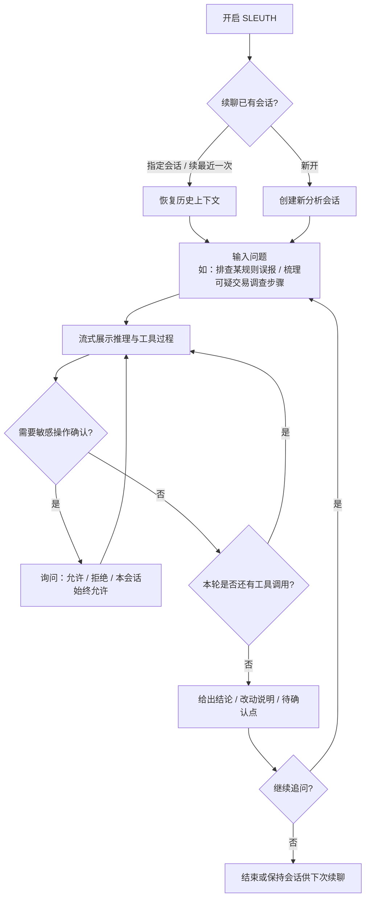
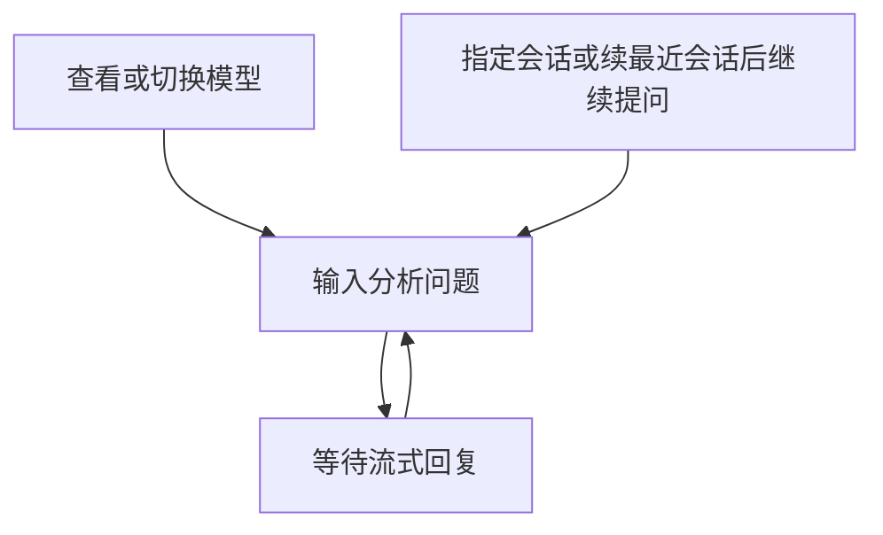
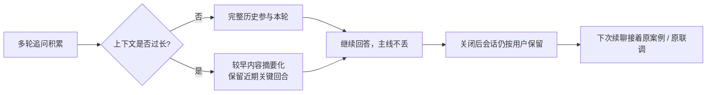

# Sleuth 架构设计

本文描述 Sleuth（反洗钱智能分析 Agent）的整体架构与模块职责，**不涉及代码实现细节**。  
安装与配置见 [README](../README.md)；如何选型并扩展能力见 [EXTENDING](./EXTENDING.md)。

---

## 1. 概述

Sleuth 是面向金融机构 / 合规科技场景的 **反洗钱（AML）智能分析 Agent**：在本地或服务端工作区中，驱动「大模型 ↔ 工具 / 知识包」多轮协作，协助完成反洗钱相关分析能力的设计、实现、联调与演进。

典型业务覆盖包括：

- 客户尽职调查（KYC / CDD / EDD）
- 交易监控与可疑交易识别、调查编排
- 名单筛查（制裁 / PEP / 负面信息）
- 客户与交易风险评级
- 图谱与关联分析、案例管理
- 监管报送相关能力（如大额 / 可疑交易报告）的工程落地与联调

产品形态：

| 形态 | 面向谁 | 业务价值 |
|------|--------|----------|
| **本机 CLI** | 合规科技 / 风控工程研发 | 交互式分析与开发：规则与特征联调、排查误报漏报、续聊调查上下文、按需切换模型 |
| **HTTP 服务** | 多分析师 / 多租户部署 | 按用户隔离会话与用量，将同一套 AML Agent 能力嵌入内部平台或工作台 |
| **扩展面** | 二次集成方 | 通过 Tool / MCP / Skill / Agent 接入行内名单、监控引擎、案例系统等，无需分叉内核 |

一句话定位：**以共享装配拉起 AML 分析会话；经模型推理，经 Tools / MCP 对接业务系统与工程动作，经 Skills 固化领域流程与规范；会话与用量按用户可追溯持久化。**

---

## 2. 设计原则

1. **入口薄、分析内核共用**  
   CLI 与 HTTP 只负责人机交互与服务协议；规则联调、案例调查、能力演进共用同一会话循环，保证行为一致、审计口径一致。

2. **能力三分（贴合 AML 落地）**  
   - **Tool / MCP**：确定性动作与外部系统调用（改规则配置、跑批脚本、查名单/案例/监控接口等）  
   - **Skill**：可复用的领域流程与规范（排查手册、报送字段约定、调查步骤等），本身不执行副作用  
   - **Agent**：分析姿态与权限边界（如建设实现 vs 只读规划），决定可见工具与默认放行策略  

3. **权限决定可见性**  
   当前分析角色被拒绝的工具对模型不可见，降低误触敏感写操作或越权查询的风险。

4. **配置可运维、可按环境叠加**  
   以环境配置为主，复杂嵌套可叠加结构文件；便于区分开发 / 联调 / 生产密钥与模型路由。

5. **产品护栏与权限正交**  
   默认拦截对 Agent 自身源码、系统提示、密钥类路径的工具读写；「全放行」不能绕过硬拦截，保护提示词与凭证不被带入分析上下文。

6. **领域能力优先外置**  
   行内名单、监控引擎、案例库等优先以 MCP / Skill 接入；流程知识进 Skill，副作用进 Tool；共用能力改共享装配层，避免 CLI / HTTP 各写一套。

7. **结论可追溯、数据宜脱敏（产品约定）**  
   规则命中、风险判断、案例结论应能落到字段 / 阈值 / 时间窗 / 名单来源 / 关联路径；客户身份与交易材料按敏感数据对待，不无必要复述完整证件号、卡号等。

---

## 3. 逻辑架构

```text
┌──────────────────────────────────────────────────────────────┐
│  入口层     分析师 CLI  ·  多用户 HTTP（工作台 / 平台接入）      │
└────────────────────────────┬─────────────────────────────────┘
                             │ 共用装配
┌────────────────────────────▼─────────────────────────────────┐
│  装配层     配置 · 会话存储 · 权限 · 模型 Provider             │
│             · 工具注册表 · MCP（行内/外部系统）· AML Skills     │
└────────────────────────────┬─────────────────────────────────┘
                             │
┌────────────────────────────▼─────────────────────────────────┐
│  分析会话内核   领域提示组装 → 模型推理 → 工具/知识调用 → 落库  │
│                 （上下文压缩 / 会话标题 / 用量 / 工作区快照等）   │
└───────┬──────────────┬──────────────┬────────────┬───────────┘
        │              │              │            │
   Provider         Tools          Skills     Permission
   （LLM）       + MCP 桥接     （AML 知识包）  + Guardrails
        │              │              │            │
        └──────────────┴──────────────┴────────────┘
                             │
                      Storage（SQLite / MySQL）
                      会话 · 消息 · 用量（按用户）
```

业务视角下的数据流：分析师提出调查或研发问题 → 会话按当前 Agent 姿态组装 AML 领域提示与可见能力 → 模型推理并可调用工具 / MCP（对接监控、名单、案例等）或加载 Skill（标准流程）→ 结果回写会话并持久化，供续聊与用量审计。

---

## 4. 模块功能介绍

下列按职责划分，对应仓库中的逻辑边界（非实现说明）。

### 4.1 入口与装配

| 模块 | 职责（业务视角） |
|------|------------------|
| **CLI** | 分析师 / 研发本机入口：流式展示推理与工具过程、敏感操作询问确认、续聊既有调查或开发会话、交互切换模型。 |
| **HTTP Server** | 面向工作台或多分析师的薄服务层：会话与消息、按用户用量、Skills 目录查询与强制刷新；身份与管理凭据经请求头传递。 |
| **App（装配）** | CLI 与 HTTP 共用的「一次分析会话」构建：选定分析姿态与模型、拼权限、挂存储、注册工程工具并桥接 MCP、加载 AML Skills，得到可运行的 Session。 |

### 4.2 会话内核与周边能力

| 模块 | 职责（业务视角） |
|------|------------------|
| **Session** | AML 分析主循环：组装领域提示与可见工具 → 流式调用模型 → 调度工具 / 知识包 → 持久化调查与开发上下文；支持中止、重试及对接 CLI / 无 UI 场景。 |
| **Messages** | 会话内容结构：分析师输入、模型推理、工具调用与结果等有序消息块，支撑续聊与审计回看。 |
| **Prompts** | 系统提示资产与拼装：内置 AML 助手定位（含建设 / 规划等姿态）、环境信息、项目指令、护栏下的公开能力目录说明。 |
| **Instruction** | 发现项目级指令文件并纳入提示，便于仓库内沉淀本机构规则约定、字段字典、联调说明等。 |
| **Compaction** | 长调查 / 长联调上下文溢出时生成摘要并替换历史前缀，保留近期关键回合，避免丢失主线结论。 |
| **Title** | 根据首条有效问题生成会话标题，便于案例式会话列表检索。 |
| **Usage** | 统一 token / 费用口径，按轮落库、按用户汇总，支撑成本与调用审计。 |
| **Snapshot** | 在 git 工作区记录步骤前后快照，便于规则 / 特征改动的对比与回退；非 git 环境则跳过。 |
| **Retry** | 对可恢复的模型或网络类失败做退避重试，降低联调抖动导致的会话中断。 |

### 4.3 内置工具能力一览（功能视角）

面向「在工作区落地 AML 分析能力」时的工程动作（行内业务系统更宜经 MCP / Skill 接入）：

| 能力类别 | 在 AML 场景中的作用 |
|----------|---------------------|
| 工作区读写 | 读改规则配置、特征定义、联调脚本、报告模板等工程产物 |
| 检索 | 在代码与配置中定位阈值、名单引用、字段映射、报送相关实现 |
| 执行 | 在受控工作区运行验证、批处理或联调命令 |
| 人机交互 | 澄清调查口径、缺失字段或验收标准 |
| 编排 | 启动子分析任务（嵌套会话），将子结论摘要回主调查 / 主开发会话 |
| 知识 | 按名加载 AML Skill（流程手册、规范约定等）进入当前上下文 |

---

## 5. 运行模式

| 模式 | 说明 |
|------|------|
| **交互 CLI** | 分析师本机流式协作：权限询问、运行时切换模型、续聊指定会话或该用户最近一次分析会话。 |
| **HTTP 多用户** | 按用户隔离会话与用量，便于多分析师或平台侧接入；管理类接口需管理凭据；内部仍走同一装配与 Session，保证与 CLI 行为一致。 |

---

## 6. 用户体验流程

以下从**分析师**视角描述交互路径，不涉及内部实现。

### 6.1 一次分析协助

通用路径：开启 SLEUTH → 进入会话 → 提出调查或研发问题 → 边看过程输出边确认敏感操作 → 多轮追问直至结论可用。适用于本机交互等入口，不绑定具体启动方式。



体验要点：过程可见（推理与工具步骤流式出现）；写文件、跑命令、调外部系统等默认会打断询问，避免静默改动规则或触达行内接口。

### 6.2 会话中的常用操作



| 用户意图 | 体验 |
|----------|------|
| 继续昨天的调查 | 开启时续指定会话或最近一次 |
| 换更强 / 更快模型 | 会话中切换，后续回合生效 |
| 按机构标准流程排查 | 对话中由 Agent 加载 Skill，或用户点名流程 |
| 对接行内系统 | 经 MCP 调用前可能触发确认 |

### 6.3 长会话与续聊体验

长调查或多轮联调时，用户侧感受为「上下文仍连贯」，系统在背后必要时压缩较早回合。


