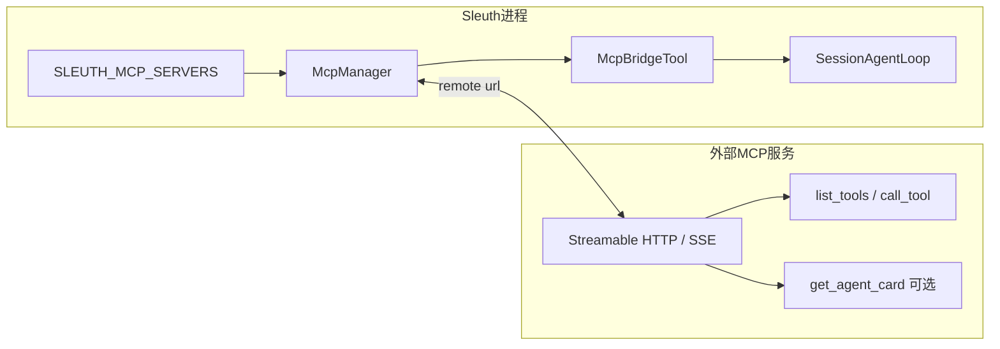
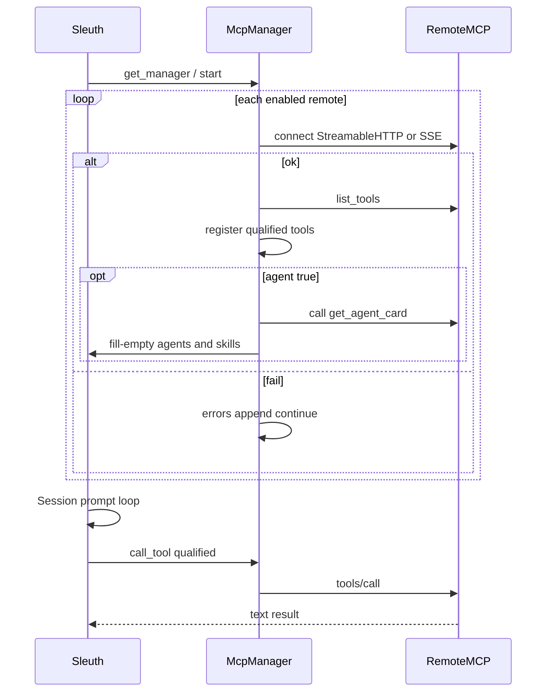

# MCP 对接文档（Tool / Agent）

> 适用：在外部进程暴露 MCP，由 Sleuth CLI / HTTP 拉取工具（可选注册 Agent）。  
> 新 Agent 从 [`agents/scaffold`](../agents/scaffold/) 生成。实现参考：[`sleuth/mcp/`](../sleuth/mcp/)、样例包 [`agents/dd_check`](../agents/dd_check/)、[`agents/dd_reply`](../agents/dd_reply/)。  
> 选型总览见 [`EXTENDING.md`](EXTENDING.md)。

---

## 1. 总览



要点：

- MVP **只连 remote URL**（Streamable HTTP，失败再试 SSE）；stdio local 配置可解析但不连接。
- **不必先起齐 MCP**：Sleuth 先启动；已在线的服务约 2s 内连上，未在线的按 `SLEUTH_MCP_RETRY_SECONDS`（默认 15s）后台重试。下一轮对话自动挂上工具 / Agent Card。
- 多服务 **并行连接、单服务限时**：一个挂起/失败不影响其它已配置服务（`SLEUTH_MCP_TIMEOUT_PER_SERVER`）。
- 立即重连：CLI `/mcp reload`，或 `POST /v1/mcp/reload`（Admin）；`GET /v1/mcp` / `/mcp` 查看状态。
- 工具名对模型可见形式：`{sanitize(server)}_{sanitize(tool)}`。
- `agent: true` 时额外调用 `get_agent_card`，用卡片 **fill-empty** 注册 Agent（本地已有同名人格则不覆盖 prompt）。Card 里带 `content` 且有 `owner_agent` 的 SOP 会覆盖目录中同名 COS/路径 skill；仅 name 的项仍走目录查找。

---

## 2. 配置

### 2.1 环境变量（推荐）

```env
# 多服务 JSON；.env 覆盖 JSONC
SLEUTH_MCP_SERVERS={"ddcheck":{"type":"remote","url":"http://127.0.0.1:8791/mcp","agent":true},"docs":{"type":"remote","url":"https://mcp.example.com/mcp","headers":{"Authorization":"Bearer xxx"}}}

SLEUTH_MCP_TIMEOUT_STARTUP=30000
SLEUTH_MCP_TIMEOUT_REQUEST=120000
# 未连上的服务后台重试间隔（秒）；0 = 关闭自动重试
SLEUTH_MCP_RETRY_SECONDS=15
# Agent Card 里对 bash/edit/write/task 写 allow 时，默认降级为 ask
SLEUTH_MCP_AGENT_TRUST_PERMISSIONS=0
# 合并进每一个 MCP 的 HTTP headers；同名键以该 server 自己的 headers 为准。
# 与各 Agent `{PKG}_MCP_TOKEN` 使用同一 Bearer。空对象 / 不设 = 不加全局头。
# SLEUTH_MCP_HEADERS={"Authorization":"Bearer change-me"}
```

### 2.2 服务字段（`McpServerConfig`）

| 字段 | 类型 | 默认 | 说明 |
|------|------|------|------|
| （对象键） | string | — | **server 名**，进入工具前缀 |
| `type` | string | 有 url→`remote` | 传输类型 |
| `url` | string | — | remote 必填 |
| `headers` | object | `{}` | HTTP 头（覆盖 `SLEUTH_MCP_HEADERS` 同名键） |
| `disabled` | bool | `false` | `true` 则跳过连接 |
| `timeout.request` | int | 全局 | 单次 `call_tool` 超时（ms） |
| **`agent`** | bool | `false` | `true` → 拉 Agent Card |

`agent` 亦可写字符串：`true` / `1` / `yes` / `on`。

### 2.3 JSONC 等价写法

```jsonc
{
  "mcp": {
    "timeout": { "startup": 30000, "request": 120000 },
    "servers": {
      "ddcheck": {
        "type": "remote",
        "url": "http://127.0.0.1:8791/mcp",
        "agent": true
      }
    }
  }
}
```

---

## 3. Tool 开发对接规范

### 3.1 服务端必须实现

| MCP 能力 | 要求 |
|----------|------|
| 传输 | Streamable HTTP（推荐）或 SSE，路径与 `url` 一致 |
| `initialize` | 标准 MCP 握手 |
| `tools/list` | 返回全部可调工具 |
| `tools/call` | 按 name + arguments 执行，返回 content 文本块 |

Sleuth 侧用官方 `mcp` Python 包客户端；服务端可用 FastMCP / 任意兼容实现。

### 3.2 命名与 Schema

1. **MCP 工具原名**：稳定、可读的 snake_case（如 `check_report`）。
2. **Sleuth 暴露名**：`{server}_{tool}`，经 `sanitize_name`（非 `[A-Za-z0-9_-]` → `_`，小写）。
3. **inputSchema**：合法 JSON Schema object；Sleuth bridge **不**根据 schema 做严格 Pydantic 校验（`skip_strict_validation=True`），但仍应写清 required / properties，方便模型填参。
4. **description**：写清「何时调用、必填字段、返回形态」——这是模型选工具的主依据。
5. **返回**：优先纯文本 / JSON 字符串；错误时设 `isError` 或在文本中标明失败原因。
6. **缺料暂停（可选）**：工具可返回 JSON `{ "status": "need_input", "missing": [...], "filled": {...}, "hint": "..." }`。Sleuth **不解析**该字段。Agent Skill / 人设应要求助手调用内置 `question`，HTTP 本轮停成 `awaiting_user`。用户补料后带齐字段再调；用户明确说没有补充、请继续时再调并传 `proceed_with_gaps=true`。脚手架 `{PKG}_HITL=1` 打开该门；`question: allow` 写在 Card 上。

示例对照：

| 配置键 | MCP tool | 模型看到的名字 |
|--------|----------|----------------|
| `ddcheck` | `check_report` | `ddcheck_check_report` |
| `ddreply` | `generate_reply_framework` | `ddreply_generate_reply_framework` |

### 3.3 权限（产品侧）

- 每次调用前 bridge 会 `ctx.ask(qualified_name, …)`。
- Agent Card / `agent.md` / 全局 `permission` 可对某工具设 `allow` / `ask` / `deny`。
- `deny` + 通配会从模型可见工具列表中隐藏。
- HTTP `--yolo` / body `yolo:true` 只自动批准 bash/edit 一类「ask」确认，**不能**绕过岗位 ACL，也不能让当前不是该 agent 的会话看见/调用 `agent:true` 的 MCP 工具。通用 MCP（`agent:false`）仍对所有会话可用。

建议：对主业务 MCP 工具在 Agent 权限里写 **`allow`**，对 `bash` / `edit` / `write` 保持 **`ask`/`deny`**。

### 3.4 长耗时 / 失败

- 单工具默认请求超时约 **120s**（可按服务或全局调大，尽调检查建议远大于此）。
- 某服务连接失败：记入 `mcp_manager.errors`，**其它服务工具仍可用**；该服务工具不会进目录。
- 进程内 MCP 管理器为单例；服务事后恢复需 **重启 Sleuth 进程**（当前无热重连）。

### 3.5 Tool 开发检查清单

- [ ] `list_tools` 含稳定 name / description / inputSchema  
- [ ] 用真实 `server` 键验证合格名为 `{server}_{tool}`  
- [ ] 在 Sleuth 里对目标工具配置 permission  
- [ ] 故意关掉该 MCP，确认其它 MCP 仍可用  
- [ ] 长任务：超时、进度（Sleuth SSE 仅有 `tool_start`→`tool_result`，中间无细粒度进度）

---

## 4. Agent 开发对接规范（Agent Card）

### 4.1 何时用 Card

希望「插上 MCP + `agent:true`」后，用户可直接：

```text
sleuth --agent <card.name>
# 或 HTTP POST /v1/sessions  body: { "agent": "<card.name>" }
```

无需在仓库里放 `agent.md`（本地有同名则本地优先）。新项目从 [`agents/scaffold`](../agents/scaffold/) 生成，不要从 `dd_check` / `dd_reply` 复制业务代码。

文件解析统一在 Sleuth（解密 + excerpt）。MCP 工具 JSON Schema 只要声明 `attachment_refs_json`，桥就会在调用前注入摘录；不声明则基座不注入。声明 `sleuth_llm_json` 时桥注入当前会话模型（`model` / `base_url` / `api_key`）；**本包 `{PKG}_LLM_*` 三项配齐则 Agent 自己用，未配齐才用注入**。Sleuth **不解析** Agent 内部逻辑。工具返回值是字符串；只有希望基座做 UI/邮箱时才遵守可选顶层 JSON：`sources[]`（知识来源）、`files[]`（回传文件）。生成文件请带 `content_base64`（明文），由 Sleuth 按会话邮箱路径 SM4 加密上传；也可继续给已有 `object_key` / `https` `url`。禁止 data-URL / file-URL。脚手架始终生成 attachments / kb / output / llm / hitl 模块，但只在该 Agent 自己的 `{PKG}_*` 配齐时才注册对应工具或打开缺料门（空 env 不挂空工具）。详见 [`EXTENDING.md`](EXTENDING.md) §9b。

### 4.2 必须实现的 MCP 工具

| 工具名 | 参数 | 返回 |
|--------|------|------|
| **`get_agent_card`** | 无（`{}`） | **JSON 文本**（一条 text content） |

仅当配置 **`agent: true`** 时 Sleuth 会调用。失败只记 error，**工具列表仍保留**。

### 4.3 Card JSON Schema

**必填**

| 字段 | 类型 | 说明 |
|------|------|------|
| `name` | string | Agent id（`--agent` / HTTP `agent`） |

**常用可选**

| 字段 | 类型 | 说明 |
|------|------|------|
| `title` | string | 展示名称（前端列表用；缺省则回退为 `name`） |
| `prompt` | string | 系统人设 / 行为约束 |
| `description` | string | 列表副文案 / 能力说明 |
| `mode` | string | 建议 `primary` |
| `orchestration` | string | `host` \| `pipeline` \| `delegate` \| `async`（默认由 `SLEUTH_ORCHESTRATION_DEFAULT_MODE`） |
| `primary_tool` | string | pipeline / auto_run 默认调用的合格工具名 |
| `delegatable` | bool | 是否允许 `task` 委托（仍需 agent grant） |
| `execution` | string | `sync` \| `async` |
| `auto_invoke_prompt_field` | string | auto_run 时 prompt 映射到的工具参数名 |
| `auto_invoke_args` | object | auto_run 静态默认参数 |
| `permission` | object | 工具名 → `allow` \| `ask` \| `deny`（用 **合格名**） |
| `steps` | int | 默认 50 |
| `model` | string | 可选覆盖 |
| `skills` | array | 内嵌 Skill（见下） |
| `mcp_server` | string | 管理器会默认写成配置键 |
| `version` | string | 元数据，Sleuth 可不消费 |

**`skills[]` 项**

| 字段 | 必填 | 说明 |
|------|------|------|
| `name` | 是 | Skill id |
| `content` | 否 | 私有 SOP 正文。省略则只引用目录/COS 里的同名 skill（复用，不必再开发一份） |
| `description` | 否 | 目录短描述 |
| `mcp` | 否 | 依赖的 MCP server 名列表（warning，不是授权） |
| `tools` | 否 | 依赖的工具名列表 |

### 4.4 合并语义（fill-empty）

`apply_agent_cards_to_config`：

1. 本地 / JSONC 已存在的 Agent 字段 **不覆盖**。
2. Card 只填空字段、补缺失 permission 键。
3. Skill：进程目录里 **已有同名则跳过** Card 内嵌 content（COS/本地优先）。Card 只写 name 时用于专用 agent 自动注入目录 skill。
4. `skill_names` 与本地 JSONC `agent.<name>.skills` 做并集。
4. 敏感权限：Card 对 `bash` / `edit` / `write` / `task` 写 `allow` 时，除非 `SLEUTH_MCP_AGENT_TRUST_PERMISSIONS=1`，否则降为 **`ask`**。

### 4.5 Card 示例（结构）

```json
{
  "name": "dd_check",
  "title": "尽调报告检查",
  "description": "对已填写尽调报告做填写检查、评分并回传 Word。",
  "mode": "primary",
  "prompt": "你是尽调报告检查分析师……优先调用 ddcheck_check_report……",
  "permission": {
    "ddcheck_check_report": "allow",
    "question": "allow",
    "bash": "ask",
    "edit": "deny",
    "write": "deny"
  },
  "skills": [
    {
      "name": "dd-check-sop",
      "description": "尽调报告检查 SOP",
      "content": "---\nname: dd-check-sop\n...\n---\n# SOP\n...",
      "mcp": ["ddcheck"]
    }
  ],
  "mcp_server": "ddcheck",
  "version": "1"
}
```

权限键必须是 **Sleuth 合格名**（含 server 前缀），与 Card 里写的 MCP 原名不同。

### 4.6 Agent 开发检查清单

- [ ] 实现 `get_agent_card`，返回合法 JSON 且含 `name`；建议带 `title` 供前端展示  
- [ ] 配置 `agent: true` 后 `sleuth --agent <name>` 可用  
- [ ] `permission` 使用 `server_tool` 合格名  
- [ ] Skill `content` 非空；与本地 Skill 同名时确认优先级符合预期  
- [ ] 提供无 Card 回退：`agent.md` + `SLEUTH_SKILLS_PATHS`（运维兼容）

---

## 5. Sleuth ↔ MCP 运行时序



---

## 6. 样例与相关文件

| 角色 | 路径 |
|------|------|
| 连接 / 合格名 / Card 拉取 | [`sleuth/mcp/manager.py`](../sleuth/mcp/manager.py) |
| Bridge Tool | [`sleuth/mcp/bridge.py`](../sleuth/mcp/bridge.py) |
| Card 解析 | [`sleuth/mcp/agent_card.py`](../sleuth/mcp/agent_card.py) |
| 装配 | [`sleuth/app.py`](../sleuth/app.py) |
| 脚手架（新 Agent 项目包） | [`agents/scaffold`](../agents/scaffold/) |
| dd_check MCP | [`agents/dd_check/dd_check/mcp_server.py`](../agents/dd_check/dd_check/mcp_server.py) |
| dd_reply MCP | [`agents/dd_reply/dd_reply/mcp_server.py`](../agents/dd_reply/dd_reply/mcp_server.py) |
| 场景流程图 | [`AGENT_SCENARIOS.md`](AGENT_SCENARIOS.md) |

---

## 7. 明确不做 / 常见坑

- **裸调 MCP**：编排旁路必须走 `Session.execute_guarded_tool`（见 [`ORCHESTRATION.md`](ORCHESTRATION.md) §6）。
- 编排模式配置写死在代码里：应使用 `SLEUTH_ORCHESTRATION_*` 或 JSONC `orchestration` 块。

- 不把 MCP 内部 LangGraph 节点进度透出为 Sleuth SSE（仅 `tool_start` / `tool_result`）。
- Card 权限键写 MCP 原名（漏前缀）→ 权限不生效。
- 两个 MCP 配置键撞名或 sanitize 后撞名 → 工具互相覆盖。
- 忘记 `pip install mcp` / 服务端未装依赖 → 整类 remote 连不上。
