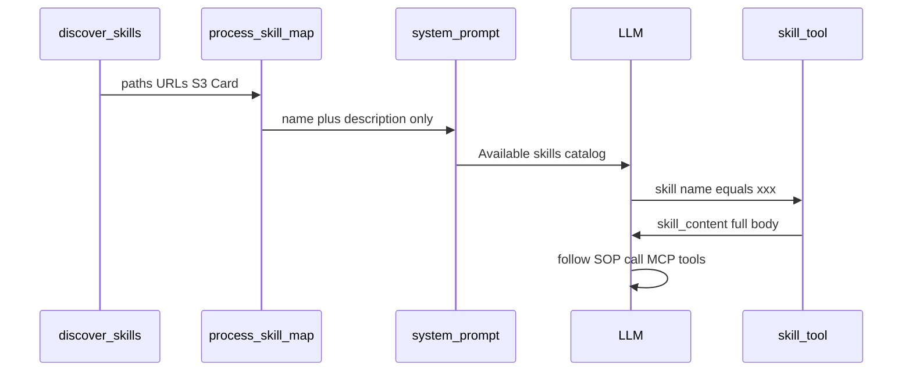

# Skill 接入文档与开发规范

> Skill = 给模型的**可复用流程说明**（SOP），**不会执行代码**。  
> 要副作用请用内置 Tool 或 MCP Tool。选型见 [`EXTENDING.md`](EXTENDING.md)。  
> 实现：[`sleuth/skill/`](../sleuth/skill/)、加载工具 [`sleuth/tools/skill_tool.py`](../sleuth/tools/skill_tool.py)。

---

## 1. 概念

| | Skill | Tool / MCP |
|--|-------|------------|
| 本质 | Markdown 知识 / SOP | 可执行副作用 |
| 进系统提示 | **仅目录**：name + 短 description | 工具名 + schema |
| 正文何时进入上下文 | 模型调用内置工具 **`skill`** 之后 | 每次 `tools/call` |
| 典型用途 | 检查步骤、答复框架写法、排查手册 | 跑检查、写文件、查库 |

配合方式（推荐）：

1. Agent prompt / Skill SOP 告诉模型「先 `skill` 加载某某，再调某某 MCP」。
2. Skill frontmatter 声明 `mcp` / `tools` 依赖；不满足时 `skill` 工具仍返回正文，但附带 warnings。

---

## 2. 接入方式（运维）

### 2.1 发现源（后写覆盖同名）

| 来源 | 配置 | 说明 |
|------|------|------|
| 全局目录 | — | `~/.config/sleuth/skills` 等 |
| 工作区 | — | `.sleuth/skills/**/SKILL.md` |
| 本地路径 | `SLEUTH_SKILLS_PATHS` / `skills.paths` | 逗号分隔或 JSONC 列表 |
| HTTP | `SLEUTH_SKILLS_URLS` | zip 或单文件 `SKILL.md` |
| S3 | `SLEUTH_SKILLS_S3` | 对象 / 前缀 / manifest（需 boto3） |
| MCP Agent Card | `agent:true` + card.`skills[]` | fill-empty；本地同名优先 |

缓存目录：`$SLEUTH_DATA_DIR/skills-cache`（或系统 data 目录下 `sleuth/skills-cache`）。

### 2.2 环境变量示例

```env
SLEUTH_SKILLS_PATHS=./agents/dd_analyst/skills,./agents/dd_reply/skills
SLEUTH_SKILLS_URLS=https://example.com/skills/pack.zip
SLEUTH_SKILLS_REFRESH_SECONDS=300
```

### 2.3 刷新

| 机制 | 行为 |
|------|------|
| TTL（默认 300s） | 下一次 `Session.prompt` 或 `GET /v1/skills` 时懒惰重扫 |
| CLI | `--refresh-skills` |
| HTTP | `POST /v1/skills/reload`（需 Admin Token，若已配置） |
| 单轮内 | 进入 prompt 后目录冻结；历史里已写入的 skill 正文不热改 |

**没有**后台定时器。

### 2.4 HTTP

- `GET /v1/skills` → `[{ name, description, location }, …]`
- `POST /v1/skills/reload` → 强制重载

前端：**只读展示能力**即可；不要做成「每轮勾选 Skill」控件（当前无会话级 skill 绑定 API）。产品入口应选 **Agent**。

---

## 3. 开发规范（作者）

### 3.1 目录布局

```text
my-skill/
  SKILL.md          # 必需
  # 可选参考资料、模板；通过正文相对路径说明，不由 Sleuth 自动执行
```

### 3.2 `SKILL.md` Frontmatter

```yaml
---
name: dd-report-check
description: 银行尽调报告智能检查。用户要求检查/评分尽调报告时使用。
mcp:
  - ddcheck
tools:
  - ddcheck_run_dd_check
  - ddcheck_resume_dd_check
---

# 尽调报告检查 SOP

1. 调用内置工具 `skill` 加载本 skill（若尚未加载）。
2. 收集报告正文 / 附件标识……
3. 调用 `ddcheck_run_dd_check`，传入……
4. 若返回 `awaiting_human`，向用户确认后调用 `ddcheck_resume_dd_check`。
…
```

| 字段 | 必填 | 说明 |
|------|------|------|
| `name` | 建议 | 缺省用父目录名；全局唯一 |
| `description` | 强烈建议 | **系统提示目录只展示这段**；写清触发场景 |
| `mcp` | 否 | 依赖的 MCP **server 配置键** |
| `tools` | 否 | 依赖的工具名（合格名 / 前缀） |

### 3.3 正文写法约定

1. **面向模型**：步骤编号、输入输出字段表、失败分支。
2. **工具名用 Sleuth 合格名**（含 server 前缀），与真实 `list_tools` 一致。
3. **不要**假设正文会自动进系统提示——必须引导调用 `skill`。
4. **不要**在 Skill 里写密钥；密钥走 MCP / `.env`。
5. 长 SOP 可分段；首段说明「何时用本 skill」。
6. 与 Agent Card 联用时：Card.`skills[].content` 可整份嵌入同一份 `SKILL.md` 文本。

### 3.4 与 Agent 的分工

| 放 Agent `prompt` | 放 Skill |
|-------------------|----------|
| 人设、权限边界、默认优先调哪个工具 | 可独立演进的长 SOP |
| 短、稳定 | 可随业务频繁改、可多入口复用 |

样例：

- [`agents/dd_analyst/skills/dd-report-check/SKILL.md`](../agents/dd_analyst/skills/dd-report-check/SKILL.md)
- [`agents/dd_reply/skills/dd-reply-framework/SKILL.md`](../agents/dd_reply/skills/dd-reply-framework/SKILL.md)

### 3.5 开发检查清单

- [ ] `name` / `description` 清晰；同名不与其它包冲突  
- [ ] 正文步骤可单独照做（工具名正确）  
- [ ] 声明 `mcp` / `tools` 依赖  
- [ ] 本地路径或 Card 注入后，`GET /v1/skills` 或 CLI 可见  
- [ ] 模型需先 `skill` 再 MCP；在 Agent prompt 里写一句提醒更稳  

---

## 4. 运行时数据流



---

## 5. 相关文件

| 路径 | 角色 |
|------|------|
| [`sleuth/skill/__init__.py`](../sleuth/skill/__init__.py) | 发现 / 缓存 / TTL |
| [`sleuth/tools/skill_tool.py`](../sleuth/tools/skill_tool.py) | 内置 `skill` |
| [`sleuth/guardrails.py`](../sleuth/guardrails.py) | 公开 skill 目录块 |
| [`sleuth/mcp/agent_card.py`](../sleuth/mcp/agent_card.py) | Card → SkillInfo |
| [`docs/API.md`](API.md) | `GET /v1/skills` |
| [`docs/MCP_INTEGRATION.md`](MCP_INTEGRATION.md) | MCP / Agent Card |
